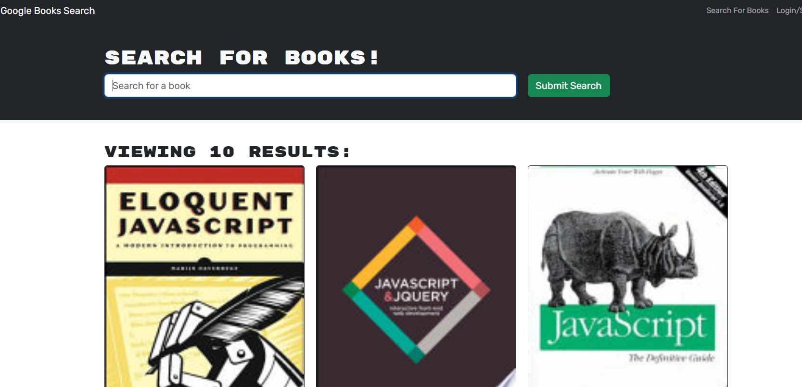

# Book Search Engine
 
  
 
  ## Table of Contents
  
  [Description](#description)

  [Installation](#installation)
  
  [Usage](#usage)
  
  [Credits](#credits)
  
  [License](#license)

  [Questions](#questions)
  
  ## Description
  This application allows users to create an account. With an account, they can search for books with the Google Books API. When they have found a book that they are interested in, the user can save that book to their collection, to maintain a wishlist of reading material.

  ## Installation
  This application was built on the MERN stack, and as such uses Mongoose as the ODM for MongoDB, Express JS, React, and Node JS. It was also built with a GraphQL Apollo server, with Json Web Tokens for authentication. All required dependencies are included in the package.json.

  ## Usage
  Users can sign up for an account by entering a username, an email address, and a password. Once signed in, users can use the search bar to search for a book. The search may yield many results, so the user can peruse the options. The books are displayed with  the cover image, the title, and a description. Once they've found the book that they were searching for, the user can click the Save This Book button to add it's details to their book list. Users can view their saved books by clicking "See Your Books."

  

  GitHub Repository:
  https://github.com/AdamJohnson92/Book-Search-Engine

  Deployed Application:
https://guarded-depths-22692-a2af01438a93.herokuapp.com/

  
  
  ## Credits
  Assistance with setting up GQL server courtesy of BCS tutor Faran Navazi.

  ## License
  
  
  
  This project uses packages and code libraries that are licensed under the terms of the MIT license.

  ## Questions?

  Contact me at:

  GitHub: https://github.com/AdamJohnson92
  
  email: adamgjohnson92@gmail.com
  
